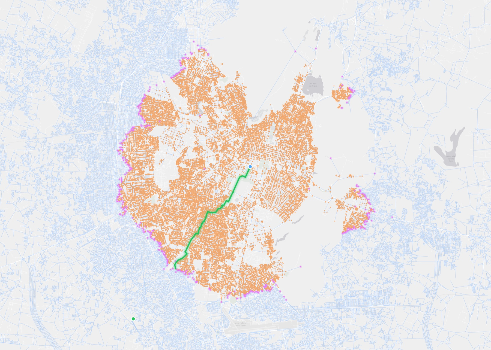
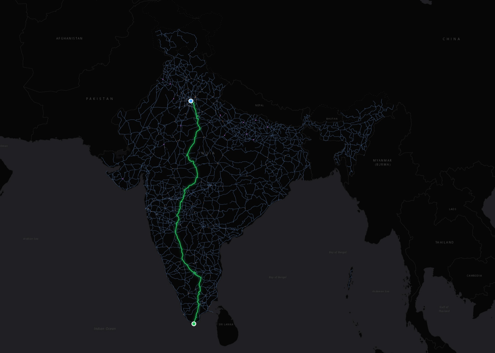
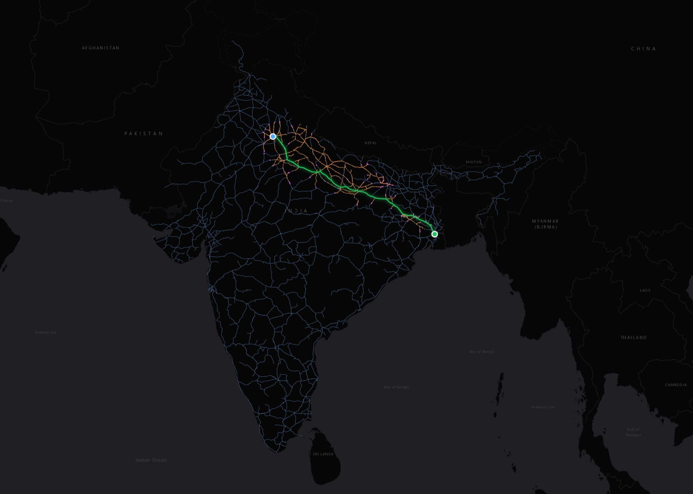
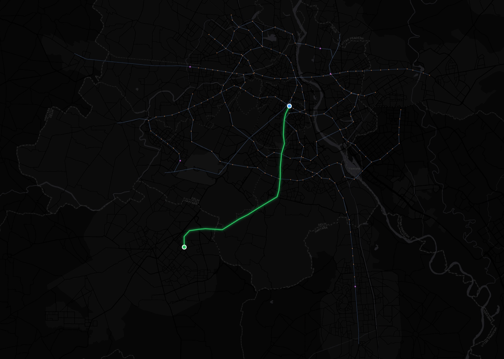
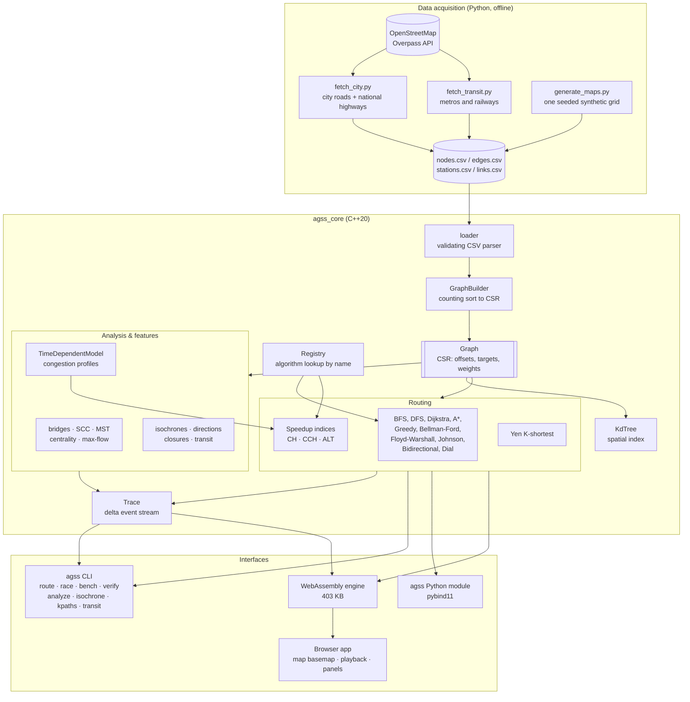
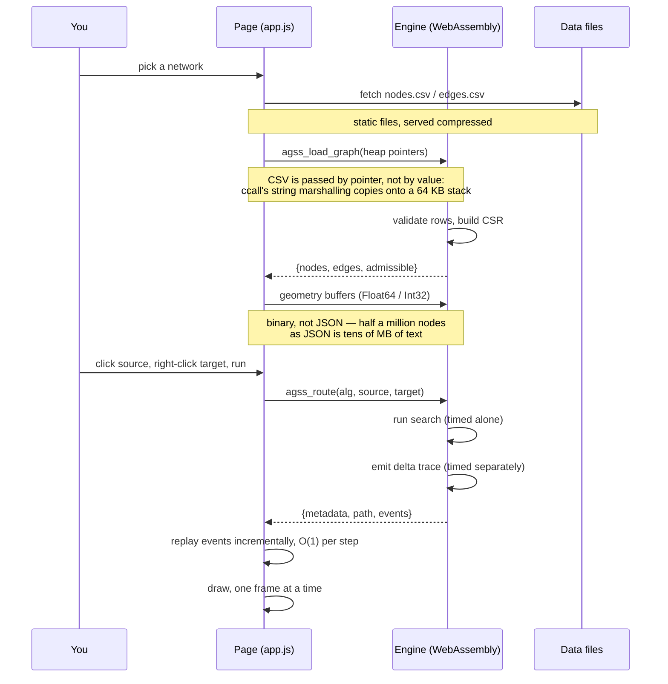
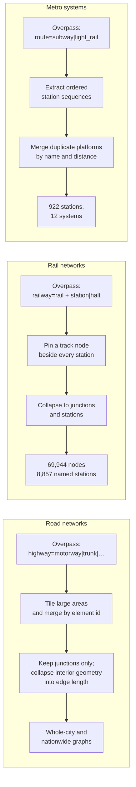

<div align="center">

# Adaptive Graph Search Suite

**A C++20 routing engine for real Indian road, metro and railway networks.**

[](https://github.com/adarshcod30/Adaptive-Graph-Search-Suite/actions/workflows/ci.yml)
[](https://github.com/adarshcod30/Adaptive-Graph-Search-Suite/actions/workflows/pages.yml)
[](LICENSE)
[](https://en.cppreference.com/w/cpp/20)
[](https://webassembly.org/)
[](https://www.python.org/)
[](https://www.openstreetmap.org/)

### [▶ Try the live demo](https://adarshcod30.github.io/Adaptive-Graph-Search-Suite/)

</div>

Twelve routing algorithms including **Contraction Hierarchies**, **Customizable
CH** and **ALT landmarks**; six network-analysis algorithms; time-dependent
routing; road, metro and railway networks across India; Python bindings; and a
browser visualiser that draws it all over a real map.

The engine compiles to WebAssembly and runs entirely in the page — no server,
no install, nothing uploaded.

`graph-algorithms` · `pathfinding` · `cpp20` · `dijkstra` · `astar` ·
`contraction-hierarchies` · `route-planning` · `openstreetmap` · `transit` ·
`india` · `webassembly` · `pybind11` · `time-dependent-routing` · `visualization`

---

## What it looks like

<div align="center">

**Dijkstra's wavefront crawling real Jaipur streets.**
Orange is settled, magenta is the live frontier, green is the route so far.



</div>

The shape is the algorithm. Dijkstra has no idea where the target is, so it
settles a disc that grows outward in every direction at once and stops only
when the target falls inside it.

<table>
<tr>
<td width="50%" valign="top">

### It does not have to be that way

**Contraction Hierarchies**, same engine, on India's national highway network.
This is the longest route the network holds — 2,935 km, 3,694 hops — and the
one where CH looks best, since its advantage grows with distance: **649 events
against Dijkstra's 392,569**. Across 300 random queries the average is 486×
fewer. Either way the route is exact, hop for hop and metre for metre.



</td>
<td width="50%" valign="top">

### It is not only roads

**India's railways**, built from track geometry rather than timetables:
69,944 track nodes and 8,857 named stations. A\* from New Delhi to Howrah
Junction comes to **1,444 km** against roughly 1,451 on the ground.



</td>
</tr>
</table>

<div align="center">

**The Delhi Metro, all 257 stations.** Rajiv Chowk to Millennium City Centre
Gurugram: 21 stops, 49.5 minutes — the real journey takes about the same.



</div>

---

## Table of contents

- [Why this exists](#why-this-exists)
- [Key features](#key-features)
- [Tech stack](#tech-stack)
- [System architecture](#system-architecture)
- [Request flow](#request-flow)
- [Data pipeline](#data-pipeline)
- [Getting started](#getting-started)
- [Usage](#usage)
- [Benchmarks](#benchmarks)
- [Speedup techniques](#speedup-techniques) — CH, Customizable CH, ALT
- [Time-dependent routing](#time-dependent-routing)
- [Python bindings](#python-bindings)
- [Correctness](#correctness)
- [Project structure](#project-structure)
- [Testing](#testing)
- [Running it in the browser](#running-it-in-the-browser) — basemap, driving the map
- [Deployment](#deployment)
- [Roadmap](#roadmap)
- [Contributing](#contributing)
- [Licence and data attribution](#licence-and-data-attribution)

---

## Why this exists

Most pathfinding visualisers animate a textbook algorithm on a toy grid. This
one runs the algorithms production routing engines actually use, on **real
OpenStreetMap networks** — 488,431 junctions across Delhi NCR, 253,748 for
Delhi alone, 207,610 for India's highway system — and answers questions about
them that a shortest-path query
cannot:

| Question | Answered by |
|---|---|
| What is the fastest route from A to B? | Dijkstra / A\* / bidirectional search |
| Can that be 400× cheaper to compute? | Contraction Hierarchies |
| What if the traffic changes every hour? | Customizable CH re-costs in milliseconds |
| How fast without spending a second on preprocessing? | ALT landmarks |
| How much longer is the same trip at 18:00? | Time-dependent routing |
| Give me three alternatives. | Yen's K-shortest paths |
| Which single road closure severs a neighbourhood? | Tarjan bridges + articulation points |
| Which intersections carry the most through-traffic? | Brandes betweenness centrality |
| Where can I get to in 20 minutes? | Isochrone bands + convex hull |
| How much traffic can move from A to B per hour? | Dinic max-flow / min-cut |
| What if this bridge shuts today? | Edge-closure masks, re-run any algorithm |
| Should I drive, take the metro, or the train? | Multi-modal road + rail routing |

Everything is verified rather than asserted: the speedup techniques are checked
against Dijkstra on every query, and the benchmark numbers in this README were
measured by the commands shown next to them.

## Key features

### Routing

| Feature | Detail |
|---|---|
| **12 routing algorithms** | BFS, DFS, Dijkstra, A\*, Greedy best-first, Bellman-Ford, Floyd-Warshall, Johnson, Bidirectional Dijkstra, Dial's bucket queue, ALT, Contraction Hierarchies |
| **Contraction Hierarchies** | What production routing engines use — **44× faster, 460× fewer nodes** than Dijkstra on India's national highway network |
| **Customizable CH** | Metric-independent build, then **38 ms to re-cost** a 207k-node network instead of 1,222 ms to rebuild it |
| **ALT landmarks** | A\* with exact landmark distances instead of geometry — 10× fewer nodes than Dijkstra, and works with no coordinates at all |
| **Time-dependent routing** | Edge costs vary through the day; a measured **2.02× rush-hour penalty**, FIFO-safe so Dijkstra stays valid |
| **K-shortest paths** | Yen's algorithm — the "show me 3 alternate routes" feature |
| **Multi-modal** | Road and rail folded into one time-weighted graph; plain Dijkstra then solves it |

### Analysis

| Feature | Detail |
|---|---|
| **Bridges & articulation points** | Tarjan, iterative — which single road closure severs a neighbourhood |
| **Betweenness centrality** | Brandes, exact or sampled — which intersections carry through-traffic |
| **Strongly connected components** | Tarjan — where one-way systems trap traffic |
| **Minimum spanning tree** | Kruskal with union-find |
| **Max-flow / min-cut** | Dinic's — how much can actually move from A to B |
| **Isochrones** | Reachability bands with convex-hull service areas |
| **What-if closures** | Shut any road, re-run any algorithm, see the detour |
| **Turn-by-turn directions** | True bearings, merged straight runs, human-readable steps |

### Data

| Network | Size | Source |
|---|---|---|
| **Delhi NCR** | 488,431 junctions, 1,249,462 edges | OpenStreetMap |
| **Delhi** (full NCT) | 253,748 junctions, 663,719 edges | OpenStreetMap |
| **Bengaluru** | 240,237 junctions, 581,639 edges | OpenStreetMap |
| **India: national highways** | 207,610 junctions, 279,666 edges | OpenStreetMap |
| **Chennai** | 141,934 junctions, 345,501 edges | OpenStreetMap |
| **Jaipur** | 123,456 junctions, 316,342 edges | OpenStreetMap |
| **Kolkata** | 104,085 junctions, 254,516 edges | OpenStreetMap |
| **Mumbai** | 79,783 junctions, 176,200 edges | OpenStreetMap |
| **India: railways** | 69,944 track nodes, 145,958 edges, 8,857 named stations | OpenStreetMap |
| **Gorakhpur** | 31,830 junctions, 77,071 edges | OpenStreetMap |
| **23 metro & RRTS systems** | 922 stations across 22 cities | OpenStreetMap |
| **Named train routes** | 746 stations, 2,062 links, 253 services | OpenStreetMap |
| **Grid** (synthetic) | 225 nodes — the only integer-weight graph | generated |

Roughly 1.74 million junctions and 4.09 million directed edges in total, 122 MB
on disk. All committed. The demo runs from a clone with no network access.

### Engineering

| Feature | Detail |
|---|---|
| **CSR graph core** | Flat-array adjacency; contiguous neighbour scans instead of pointer chasing |
| **Delta traces** | Θ(V + E) event stream instead of Θ(V²) frame snapshots — 209× smaller at 19.6k nodes |
| **Geodesy done right** | Haversine metric; A\* admissibility checked as an invariant and enforced in CI |
| **k-d tree** | O(log V) nearest-node snapping for map clicks |
| **Runs in the browser** | The whole engine as 404 KB of WebAssembly, no backend |
| **Real map basemap** | Web Mercator tiles under the graph — dark, light, street, satellite, terrain |
| **60 fps at half a million nodes** | Coalesced frames, cursor-anchored eased zoom, and detail that thins only while the camera moves |
| **Python bindings** | `pip install .` — the engine from Python, with NumPy coordinate arrays |
| **Race mode** | Every algorithm on one query, side by side, with optimality verdicts |
| **Differential verification** | Optimal algorithms cross-check each other; no golden files |

## Tech stack

| Layer | Technology |
|---|---|
| Engine | C++20 — `std::span`, structured bindings, CTAD; no third-party runtime dependencies |
| Build | CMake 3.16+ (primary), plain Makefile (fallback, no CMake needed) |
| Tests | Custom 138-line header harness; **101 C++ cases, 257,010 assertions**, plus 13 Python cases |
| CI | GitHub Actions, 8 jobs — gcc/clang/MSVC on Linux, macOS and Windows; ASan + UBSan; differential correctness; data reproducibility; WASM smoke test; Python bindings; clang-format |
| Data | OpenStreetMap via Overpass API; Python 3.9+ import scripts (stdlib only) |
| Browser | Emscripten → WebAssembly; JSON for results, packed binary for geometry |
| Basemap | Custom Web Mercator tile layer on the same canvas; OpenStreetMap, Esri and OpenTopoMap raster tiles |
| Python | pybind11 through scikit-build-core; NumPy for coordinate arrays |
| UI | Vanilla JS, HTML5 Canvas, CSS glassmorphism — no framework, no bundler |
| Dev server | Python `http.server`, stdlib only (optional; the WASM build needs none) |

---

## System architecture



**In plain language.** Python scripts pull real data from OpenStreetMap once and
write plain CSV. The C++ core loads it through a validating parser — an edge
pointing at a node that was never declared is rejected here rather than causing
trouble three layers down. The builder sorts edges into Compressed Sparse Row
layout, giving every algorithm a contiguous array to scan instead of a hash map
to chase pointers through.

Above that sit three kinds of consumer. Plain algorithms register themselves by
name, so the CLI, race mode and benchmark harness share one lookup table. The
speedup techniques (CH, CCH, ALT) are *indices*: they preprocess a graph once
and answer many queries against it, which is why they carry their own types
rather than hiding behind the same interface. And the time-dependent model is a
metric rather than an algorithm — it produces edge weights that CCH can be
re-customized against in milliseconds.

The same core compiles three ways: a native CLI, a Python extension module, and
WebAssembly for the browser.

## Request flow

Nothing leaves the tab. The engine is WebAssembly living in the page, so a
search is a function call across the JS/WASM boundary rather than a round trip
to a server.



## Data pipeline



**Junction collapsing.** Only nodes where ways meet become graph nodes; the
geometry between junctions folds into the edge length. That removes 56–93% of
raw OSM nodes without changing a single route.

**Tiling.** A whole-region box like Delhi NCR is 279,000 ways, and Overpass
simply refuses it. Areas past a threshold are split into a grid, fetched
separately and merged by element id. Ways straddling a tile edge come back in
several tiles, which merging makes harmless, and `node(w)` fetches each way's
full geometry regardless of which tile requested it — so nothing is clipped at
a seam. Requests also rotate across public mirrors, because a run pulling
several whole-city extracts will exhaust one instance's slot allowance and
start receiving XML errors in place of JSON.

**Station pinning, on rail.** Keeping only junctions strands any station
sitting mid-way along a long straight run: it has no graph node anywhere near
it, and 7,709 of 10,210 stations ended up unplaced on the first attempt.
Pinning the nearest *track* node for each station into the kept set gives every
station somewhere to attach, and takes placement to 8,857.

**Platform merging, on metro.** OpenStreetMap models each platform and each
direction as its own node, so a major interchange arrives as four or more
disconnected stations. Left alone the network fragments and line changes become
impossible. Folding same-named nodes within a radius collapsed **873
duplicates**, and is what makes interchange routing work at all. The radius
differs by mode on purpose: metro platforms sit within a few hundred metres,
while a main-line terminus like Howrah Junction spans over a kilometre.

**Self-consistent coordinates.** Coordinates are rounded *before* any distance
is derived from them, so every weight is computed from exactly the numbers the
file stores. Doing it the other way round left ~18k Jaipur edges up to 13 cm
shorter than the straight line between their stored endpoints — enough to make
the A\* heuristic an over-estimate and cost it its optimality guarantee.

### How good is the data?

Routing on real track geometry reproduces published rail distances closely:

| Route | Computed | Actual | Error |
|---|---|---|---|
| New Delhi → Howrah Junction | 1,444 km | 1,451 km | 0.5% |
| New Delhi → Mumbai Central | 1,387 km | 1,384 km | 0.2% |
| Jaipur Junction → New Delhi | 310 km | 308 km | 0.6% |
| Howrah Junction → Gorakhpur Junction | 776 km | 783 km | 0.9% |

Metro journey times are estimated from distance and an average speed, since OSM
carries no timetables — Rajiv Chowk to Millennium City Centre comes out at
49.5 minutes against a real ~50.

## Getting started

### Requirements

- A C++20 compiler (GCC 10+, Clang 12+, MSVC 19.29+)
- CMake 3.16+ *or* GNU Make
- Emscripten 3.1+, only if you want to build the browser version yourself
- Python 3.9+ — for the bindings, for refreshing the data, and to serve
  the browser build locally (a `.wasm` module will not load over `file://`)

### Build and run

```bash
git clone https://github.com/adarshcod30/Adaptive-Graph-Search-Suite.git
```

```bash
cd Adaptive-Graph-Search-Suite && make -j && ./bin/agss maps
```

```
NETWORK                  NODES      EDGES  SOURCE
--------------------------------------------------------
India: highways         207610     279666  OpenStreetMap
India: railways          69944     145958  OpenStreetMap
Delhi                   253748     663719  OpenStreetMap
Delhi NCR               488431    1249462  OpenStreetMap
Mumbai                   79783     176200  OpenStreetMap
Bengaluru               240237     581639  OpenStreetMap
Jaipur                  123456     316342  OpenStreetMap
Kolkata                 104085     254516  OpenStreetMap
Chennai                 141934     345501  OpenStreetMap
Gorakhpur                31830      77071  OpenStreetMap
Grid (synthetic)           225        840  generated
metro networks             922       1900  OpenStreetMap
Indian Railways            746       2062  OpenStreetMap
```

With CMake instead:

```bash
cmake -S . -B build -DCMAKE_BUILD_TYPE=Release && cmake --build build -j
```

### Launch the visualiser

The visualiser is the WebAssembly build, and it needs no server of its own —
just something to serve the static files, because browsers refuse to load a
`.wasm` module over `file://`.

```bash
emcmake cmake -S . -B build/wasm -DCMAKE_BUILD_TYPE=Release \
  -DAGSS_BUILD_TESTS=OFF -DAGSS_BUILD_CLI=OFF && cmake --build build/wasm -j
python3 -m http.server 8000
```

Then open <http://127.0.0.1:8000/web/>. Or skip all of it and use the
[live demo](https://adarshcod30.github.io/Adaptive-Graph-Search-Suite/).

### Install the Python module

```bash
pip install .
```

### Refresh the data

```bash
python3 scripts/fetch_city.py --city bengaluru
```

```bash
python3 scripts/fetch_city.py --highways IN --out-root data/networks
```

```bash
python3 scripts/fetch_transit.py --kinds metro
```

```bash
python3 scripts/fetch_transit.py --kinds rail
```

```bash
python3 scripts/fetch_railway_network.py
```

---

## Usage

Every command takes `--graph <dir>`, and `--geo` when the coordinates are lat/lon
— which every OpenStreetMap import is.

### Route

```bash
./bin/agss route --graph data/cities/Jaipur --geo --alg astar --source 2746 --target 16278 --directions
```

### Race every algorithm on one query

```bash
./bin/agss race --graph data/networks/India_Highways --geo --source 30678 --target 175037 --algs dijkstra,astar,alt,ch
```

```
ALG                   MS   EXPANDED    RELAXED   HOPS          COST  OPTIMAL
----------------------------------------------------------------------------
dijkstra          8.1136     179346     243626   2614   2432977.352  optimal
astar             7.1010      83555     116103   2614   2432977.352  optimal
alt               1.9760      14598      20439   2614   2432977.352  optimal
ch                0.3129        194       2327   2614   2432977.352  optimal

reference optimal cost: 2432977.352
```

A 2,433 km route across India. Every technique returns the identical cost; only
the amount of graph they touch differs.

Run it without `--algs` to include everything. An algorithm that **declines** is
reported separately from one that searched and found nothing — Dial's bucket
queue is only defined for integer weights, and Floyd-Warshall's V² matrices do
not fit at scale, so both say so rather than returning a rounded or truncated
answer.

### Alternative routes

```bash
./bin/agss kpaths --graph data/cities/Jaipur --geo --source 2746 --target 16278 --k 3
```

```
K SHORTEST ROUTES  (2.2257 ms)
  route 1: cost 1748.130  (38 hops, +0.0% vs best)
  route 2: cost 1748.260  (36 hops, +0.0% vs best)
  route 3: cost 1751.922  (39 hops, +0.2% vs best)
```

### Isochrones

```bash
./bin/agss isochrone --graph data/cities/Jaipur --geo --source 2746 --cutoffs 1000,3000,6000
```

```
ISOCHRONES from node 2746  (1.6195 ms)
CUTOFF           REACHABLE     SHARE    HULL PTS
------------------------------------------------
1000.0                 659      3.4%          16
3000.0                3532     18.5%          15
6000.0               12601     65.9%          26
```

### Analyse the network

```bash
./bin/agss analyze --graph data/cities/Delhi --geo --what bridges
```

`--what` accepts `bridges`, `scc`, `mst`, `centrality`, `flow`, or `all`.

### Close a road and re-route

```bash
./bin/agss route --graph data/cities/Jaipur --geo --alg dijkstra --source 2746 --target 16278 --close 4102:4103
```

### Metro, railways and multi-modal

```bash
./bin/agss transit --transit data/railways --source "New Delhi" --target "Howrah Junction"
```

```bash
./bin/agss transit --transit data/transit --city Delhi --source "Rajiv Chowk" --target "Akshardham"
```

```bash
./bin/agss transit --transit data/transit --city Delhi --graph data/cities/Delhi --source "Rajiv Chowk" --target "Akshardham"
```

The third form folds the road network in, so a journey can walk, drive and ride.

### Benchmark and verify

```bash
./bin/agss bench --markdown --reps 7
```

```bash
./bin/agss verify --graph data/cities/Jaipur --geo --samples 200
```

`verify` is the differential harness: it makes every algorithm that claims
optimality answer the same random queries and reports any disagreement.

---

## Benchmarks

All figures below are measured, not estimated. Apple M-series, `-O2`, tracing
disabled, median of repeated runs.

### The whole country

India's expressway and national-highway network: **207,610 nodes, 279,666
edges**. 57 random long-distance queries, average per query, native build:

| Algorithm | Preprocessing | Per query | Nodes expanded | vs Dijkstra |
|---|---|---|---|---|
| Dijkstra | — | 3.94 ms | 91,556 | — |
| **ALT** (12 landmarks) | 249 ms | 0.87 ms | 8,970 | 4.5× faster, 10× fewer |
| **Customizable CH** | 111 ms + 38 ms / metric | 0.13 ms | 249 | 31× faster, 368× fewer |
| **Contraction Hierarchies** | 1,222 ms | 0.089 ms | 198 | **44× faster, 460× fewer** |

**Zero mismatches.** All three speedup techniques are exact — they return the
same route Dijkstra does, on every query.

### One city

Delhi, the whole NCT out to the airport and beyond: **253,748 junctions,
663,719 edges**. One query, five repetitions, median reported —
`agss bench --markdown --geo --graph data/cities/Delhi`.

| Algorithm | Median ms | Nodes expanded | Cost (m) | Optimal |
|---|---|---|---|---|
| Greedy best-first | 0.022 | 374 | 25,076 | no |
| DFS | 0.026 | 3,499 | 180,082 | no |
| **ALT** | 0.313 | 3,218 | 19,198 | yes |
| **Contraction Hierarchies** | 0.359 | 2,019 | 19,198 | yes |
| BFS | 1.068 | 65,838 | 21,764 | no |
| **A\*** | 1.567 | 15,311 | 19,198 | yes |
| Dijkstra | 4.723 | 72,189 | 19,198 | yes |
| Johnson | 5.770 | 72,189 | 19,198 | yes |
| Bidirectional Dijkstra | 6.012 | 59,778 | 19,198 | yes |
| Bellman-Ford | 660.167 | 88,052,145 | 19,198 | yes |

Every optimal algorithm returns 19,198 m. The three suboptimal ones are honest
about it: greedy best-first is 215× faster than Dijkstra for a route 31% longer,
which is the trade it exists to make.

The CH figure here is deliberately unflattering. `bench` builds with the
library's default 20-second budget, and Delhi needs 233 seconds to contract
fully, so this is a *truncated* hierarchy — what twenty seconds of
preprocessing buys you. It still expands 36× fewer nodes than Dijkstra and
answers 13× faster. On India's highway network, where contraction completes in
1.2 seconds, the same comparison is 460× fewer nodes and 44× faster.

Dial and Floyd-Warshall decline on this graph — non-integer weights and V²
memory respectively — rather than answering approximately.

Analysis on the same network: **43,189 bridges** and 38,589 articulation points
in **52.6 ms**; 856 strongly connected components, the largest holding 252,147
of the 253,748 nodes, in **5.9 ms**.

### Rush hour

Bengaluru, a 16.4 km cross-city trip departing at each hour, routed on the
time-dependent metric:

| Departure | Duration | |
|---|---|---|
| 00:00 | 24.6 min | ▇▇▇▇▇▇▇▇▇▇▇▇ |
| 05:00 | 27.7 min | ▇▇▇▇▇▇▇▇▇▇▇▇▇▇ |
| 07:00 | 41.3 min | ▇▇▇▇▇▇▇▇▇▇▇▇▇▇▇▇▇▇▇▇▇ |
| **08:00** | **48.2 min** | ▇▇▇▇▇▇▇▇▇▇▇▇▇▇▇▇▇▇▇▇▇▇▇▇ |
| 13:00 | 34.2 min | ▇▇▇▇▇▇▇▇▇▇▇▇▇▇▇▇▇ |
| 17:00 | 48.0 min | ▇▇▇▇▇▇▇▇▇▇▇▇▇▇▇▇▇▇▇▇▇▇▇▇ |
| **18:00** | **49.5 min** | ▇▇▇▇▇▇▇▇▇▇▇▇▇▇▇▇▇▇▇▇▇▇▇▇▇ |
| 21:00 | 32.6 min | ▇▇▇▇▇▇▇▇▇▇▇▇▇▇▇▇ |
| 23:00 | 25.9 min | ▇▇▇▇▇▇▇▇▇▇▇▇▇ |

**A 2.01× penalty** between the quietest and busiest departure, with the two
peaks falling either side of the working day rather than at a single midpoint.
The curve is generated, not observed — hourly congestion profiles are assigned
by road class — but it is FIFO by construction, so leaving later can never
arrive earlier, and the earliest-arrival search stays label-setting.

Re-costing the whole network for a different hour takes **172 ms** on this
graph (see the CCH row below), which is what makes scanning all 24 departures
interactive.

### Preprocessing cost by network

Measured with `agss bench --preprocessing --markdown --geo --graph <dir>`, so
these are reproducible rather than quoted from memory.

| Network | Nodes | CH build | CCH build | CCH re-customize | ALT build |
|---|---|---|---|---|---|
| Gorakhpur | 31,830 | 0.9 s | 22 ms | **7.6 ms** | 45 ms |
| India: railways | 69,944 | 0.3 s | 25 ms | **4.2 ms** | 72 ms |
| Mumbai | 79,783 | 1.9 s | 68 ms | **26 ms** | 120 ms |
| Kolkata | 104,085 | 27 s | 196 ms | **66 ms** | 172 ms |
| Jaipur | 123,456 | 45 s | 204 ms | **85 ms** | 263 ms |
| Chennai | 141,934 | 37 s | 203 ms | **78 ms** | 249 ms |
| India: highways | 207,610 | **1.2 s** | 111 ms | **38 ms** | 249 ms |
| Bengaluru | 240,237 | 444 s | 552 ms | **172 ms** | 480 ms |
| Delhi | 253,748 | 233 s | 616 ms | **279 ms** | 518 ms |

Two things stand out.

**CH's build cost is not a function of graph size.** India's highway network is
207,610 nodes and contracts in 1.2 seconds. Bengaluru is 240,237 nodes —
16% larger — and takes 444 seconds, nearly 400 times longer. Contraction
Hierarchies exploit low *highway dimension*: the number of vertices needed to
cover all shortest paths at a given scale. A national highway skeleton has a
tiny one by construction, so most nodes contract without adding a shortcut. A
dense city grid where thousands of residential streets substitute for one
another has a large one, so contracting any node forces many shortcuts, which
makes every later contraction worse. The cost compounds.

**That is the entire argument for Customizable CH.** CCH skips witness search
and builds a metric-independent chordal structure instead, so the same
Bengaluru network is ready in 552 ms rather than 444 seconds — an 800× cheaper
build — and re-costing it for a new traffic metric takes 172 ms. CH pays its
cost once and cannot re-cost at all without rebuilding.

Because a full contraction can run for minutes, the library defaults to a
20-second budget (`BuildOptions::budget_ms`) so a pathological graph cannot
hang a browser tab. An exhausted budget leaves the hierarchy *correct* —
uncontracted nodes sit at the top level and queries search them normally — just
less selective. The benchmark above raises that budget with `--budget` to
measure the true figure, and marks any build that still hits it.

### Trace size

The trace format stores deltas rather than per-frame snapshots, which is what
allows city-scale graphs:

| Nodes | Previous format | Delta format | Reduction |
|---|---|---|---|
| 3,600 | 30 MB | 0.8 MB | 37× |
| 10,000 | 239 MB | 2.3 MB | 103× |
| 19,600 | 980 MB | 4.7 MB | 209× |

The reduction grows with graph size because the old format was Θ(V²) and the new
one is Θ(V + E).

---

## Speedup techniques

Three ways to make a shortest-path query faster than Dijkstra, each trading a
different amount of preprocessing for a different amount of speed. Measured on
**India's national highway network** — 207,610 nodes, 279,666 edges — over 57
random long-distance queries:

| | Preprocessing | Per query | Nodes expanded | vs Dijkstra |
|---|---|---|---|---|
| Dijkstra | — | 3.94 ms | 91,556 | — |
| **ALT** (12 landmarks) | 249 ms | 0.87 ms | 8,970 | 4.5× faster, 10× fewer |
| **Customizable CH** | 111 ms + 38 ms per metric | 0.13 ms | 249 | 31× faster, 368× fewer |
| **Contraction Hierarchies** | 1,222 ms | 0.089 ms | 198 | **44× faster, 460× fewer** |

**Zero mismatches.** All three are exact: they return the same route Dijkstra
does, verified on every query.

### ALT: A\* with landmarks

A\* is only as good as its heuristic, and straight-line distance is weak on a
road network — roads bend, so the true cost sits well above the crow-flies
estimate and the search fans out anyway. ALT replaces geometry with
measurement: store exact distances to and from a handful of landmarks, then the
triangle inequality gives a lower bound that is *tight* where the route runs at
a landmark. It needs no coordinates at all, so it works where geometry is
missing or meaningless.

One subtlety cost real debugging time. Landmarks are chosen farthest-point
first, and the seed matters: a real extract has a few hundred nodes stranded at
the clipping boundary, and seeding from one meant the first landmark reached
almost nothing, every distance came back infinite, and selection collapsed to
picking the same node repeatedly. The bound was then zero everywhere and ALT
silently degenerated into plain Dijkstra — same 4,044 expansions, no error
anywhere. Anchoring selection to the largest strongly connected component fixes
it, and inside one component every pair is mutually reachable so every landmark
says something useful.

### Customizable Contraction Hierarchies

Plain CH bakes the weights into its shortcuts, so any change to the metric —
live traffic, a different hour, avoiding tolls — means redoing the contraction.
On a city that is a second of work for a change that should cost milliseconds.

CCH splits preprocessing in two. **Build** records the *shape* of the shortcut
graph without ever looking at a weight, so it is valid for every metric on that
network. **Customize** fills in the weights by enumerating lower triangles in
contraction order. Because build adds a shortcut for every pair of higher
neighbours rather than only where a witness search fails, the result is chordal
— for any triangle v < x < y the arc between x and y is guaranteed to exist,
and that guarantee is what makes customization a single pass rather than
another search.

On Jaipur: **build 31 ms once, then 10 ms per metric** against plain CH's 745 ms
every time — a 68× faster re-weighting, for a query that expands 213 nodes
instead of 201.

### Contraction Hierarchies

The technique production routing engines actually use.

Nodes are contracted one at a time in increasing order of importance. Removing
a node means adding shortcut edges between its neighbours wherever the path
through it was the only shortest one. Once every node is contracted, each edge
and shortcut is oriented from the less important endpoint to the more important
one, and a query becomes a bidirectional search that only ever moves *upward*.
Road networks have very low highway dimension — long trips funnel onto a few
arterials — so both searches climb to a shared core almost immediately.

Per network, 300 random source/target pairs from a fixed seed, measured
through the WebAssembly build — the same engine the browser demo runs:

| Network | Nodes | CH build | Dijkstra | CH | Speedup |
|---|---|---|---|---|---|
| Gorakhpur | 31,830 | 1.0 s | 0.777 ms / 15,793 nodes | 0.032 ms / 193 nodes | **24× faster, 82× fewer** |
| India: railways | 69,944 | 0.3 s | 1.291 ms / 30,325 nodes | 0.037 ms / 84 nodes | **35× faster, 361× fewer** |
| Mumbai | 79,783 | 2.4 s | 2.131 ms / 39,747 nodes | 0.060 ms / 239 nodes | **36× faster, 167× fewer** |
| Kolkata | 104,085 | 41.9 s | 2.481 ms / 47,677 nodes | 0.126 ms / 446 nodes | **20× faster, 107× fewer** |
| Chennai | 141,934 | 58.2 s | 3.621 ms / 67,526 nodes | 0.149 ms / 450 nodes | **24× faster, 150× fewer** |
| **India: highways** | 207,610 | **1.5 s** | 4.576 ms / 97,509 nodes | 0.117 ms / 200 nodes | **39× faster, 486× fewer** |

**Zero cost mismatches across 1,712 queries.** CH is a preprocessing technique,
not an approximation — a missed witness costs an unnecessary shortcut, never a
different answer.

The pattern from the preprocessing table repeats here. India's highway network
is the largest row and also the cheapest to build and the most effective to
query: 1.5 seconds of contraction buys a 486× reduction in search. Kolkata is
half the size, takes 28× longer to contract, and yields a fifth of the pruning,
because a uniform city grid gives the hierarchy far less to exploit.

Build times here run about 1.5× the native figures in the preprocessing table —
41.9 s against 27 s for Kolkata — which is the usual WebAssembly overhead on
allocation-heavy work. Query times carry the same penalty, so the *ratios* are
what transfer; the absolute numbers are what a browser visitor actually gets.

Networks omitted from this table are the ones where a full contraction runs for
minutes: Delhi (233 s natively), Bengaluru (444 s) and Delhi NCR. They work,
and the browser falls back to a budgeted partial hierarchy for them, but timing
a 300-query sweep behind a build that long says more about the machine than the
algorithm.

Three things worth knowing about the implementation:

- **A cheaper witness search is a false economy.** Halving the search bound to
  save preprocessing time made it *three times slower*: every witness missed
  becomes a shortcut, and those shortcuts make every later contraction more
  expensive. The real win was mechanical — hoisting a hash-map allocation out
  of the innermost loop cut Delhi's build from 2,004 ms to 1,096 ms.
- **CH suits road networks, not arbitrary graphs.** Arc growth is 2.1–2.3× on
  real cities and above 9× on a dense random graph, which is a property of the
  input, not a defect. Preprocessing carries a time budget so a pathological
  graph cannot hang a browser tab.
- **An exhausted budget stays correct.** Uncontracted nodes form a core that
  never had its shortcuts computed; ranking it above the contracted nodes is
  not enough, because an up-only search can traverse a core arc in one
  direction only. Core arcs are given to *both* searches, which turns the core
  back into an ordinary bidirectional Dijkstra. Answers stay exact; only speed
  degrades.

## Time-dependent routing

A road network is not a static graph. Outer Ring Road at 09:00 and at 02:00 are
different graphs with the same shape, and the fastest route changes with them.
Each edge carries a congestion profile sampled through the day and interpolated
between hours; the tier is assigned by length percentile, so a residential lane
does not gridlock the way a trunk route does.

Bengaluru, the same trip departing at each hour:

```
  00:00   13.6 min  ######
  07:00   21.8 min  ##########
  08:00   26.1 min  #############
  18:00   27.5 min  ##############
```

**A 2.02× rush-hour penalty**, which is about right for the city.

The property that makes this tractable is **FIFO**, also called non-overtaking:
leaving later can never get you there earlier. Real traffic satisfies it — you
cannot overtake yourself by departing later — and it is what keeps a
label-setting search like Dijkstra correct on a time-dependent graph. Without
it the problem is NP-hard in general. The model enforces FIFO explicitly rather
than trusting the profile to be smooth, because a single violation invalidates
the search silently, producing a plausible-looking wrong route.

Two units bugs are worth naming, because neither had a type to catch it: edge
weights are metres and travel times are seconds, and a first pass conflated
them and reported 150 minutes to cross Bengaluru. Congestion tiers were also
assigned by length *relative to the longest edge*, which a single long bypass
flattened into a 1.13× swing; ranking by percentile fixed it.

## Python bindings

Researchers work in Python and will not link a C++ library to try an idea.

```bash
pip install .
```

```python
import agss

g = agss.load("data/cities/Jaipur", geographic=True)
print(g)                                   # <agss.Graph 123456 nodes, 316342 edges>

r = g.route("astar", 2746, 16278)
print(r.cost, len(r.path), r.nodes_expanded)

ch = agss.ContractionHierarchy()
ch.build(g)                                # ~800 ms, once
print(ch.query(2746, 16278).cost)          # microseconds, thereafter

# Rush hour, without leaving Python.
m = agss.TimeDependentModel(g)
scan = agss.scan_departures(m, 2746, 16278, samples=24)
print(scan.best_duration / 60, scan.worst_duration / 60)

# Coordinates arrive as NumPy arrays, ready to plot.
xs, ys = g.coordinates()
```

Analysis is exposed too: `bridges`, `betweenness_centrality`,
`strongly_connected_components`, `minimum_spanning_tree`, `max_flow`,
`k_shortest_paths`, `isochrone` and `directions`.

## Correctness

Four algorithms guarantee optimality by construction, so **they are each other's
oracle** — no golden files, no hand-computed expected answers:

```bash
./bin/agss verify --graph data/cities/Jaipur --geo --samples 200
```

The test suite asserts, over randomly generated graphs, that:

- every algorithm claiming optimality returns the identical cost;
- every returned path is a real sequence of edges starting at the source and
  ending at the target;
- BFS is hop-minimal on unit-weight graphs;
- suboptimal algorithms are never *cheaper* than the optimum;
- A\* matches Dijkstra on geographic graphs (pinning heuristic admissibility);
- bidirectional search matches Dijkstra while expanding fewer nodes;
- Yen's routes are loopless, distinct and cost-ordered;
- a delta trace replays into exactly the path the search returned;
- every generated graph keeps the straight-line heuristic admissible.

### The admissibility invariant

A\* and Greedy estimate remaining cost with straight-line distance. That is only
a *lower* bound — and therefore only safe — when no edge weighs less than the
straight-line distance between its endpoints. Real roads always satisfy this
(a road cannot be shorter than the crow flies), but a generator can easily
violate it, and this one did: it applied a noise factor from 0.9 to 1.2, so
around 40% of edges came out shorter than the straight line. A\* then disagreed
with Dijkstra on roughly 2% of queries while looking like an algorithm bug.

The generator now uses a detour factor of 1.05-1.35, and `Graph` exposes the
invariant directly:

```cpp
if (!g.heuristic_is_admissible()) { /* A* is not optimal on this graph */ }
```

`agss verify` prints a warning when a graph violates it, so a data problem never
again reads as an algorithm problem.

---

## Project structure

```
.
├── CMakeLists.txt              Primary build; also drives the WASM and Python targets
├── Makefile                    Fallback build; make test / sanitize / bench / verify
├── pyproject.toml              Python packaging (scikit-build-core + pybind11)
├── include/agss/               Public headers
│   ├── graph.hpp               CSR graph
│   ├── graph_builder.hpp       Validating builder
│   ├── loader.hpp              CSV parsing
│   ├── error.hpp               Result<T> / Error
│   ├── geo.hpp                 Haversine, bearings, turn angles
│   ├── algorithm.hpp           Interface, registry, closure masks
│   ├── trace.hpp               Delta event stream
│   ├── contraction_hierarchy.hpp   CH
│   ├── customizable_ch.hpp     CCH: metric-independent build + fast customization
│   ├── alt.hpp                 ALT landmarks
│   ├── time_dependent.hpp      Congestion profiles, earliest arrival, day scans
│   ├── analysis.hpp            Bridges, SCC, MST, centrality, flow
│   ├── isochrone.hpp           Reachability bands, convex hull
│   ├── kshortest.hpp           Yen's algorithm
│   ├── directions.hpp          Turn-by-turn
│   ├── transit.hpp             Metro and rail networks, multi-modal
│   └── kdtree.hpp              Spatial index
├── src/
│   ├── algorithms/             uninformed, weighted, global, kshortest,
│   │                           contraction_hierarchy, customizable_ch, alt,
│   │                           time_dependent
│   ├── analysis/               connectivity, centrality, spanning, flow
│   ├── transit/                multimodal
│   ├── wasm/bindings.cpp       Emscripten entry points
│   └── cli/main.cpp            Subcommand CLI
├── python/
│   ├── bindings.cpp            pybind11 module
│   ├── agss/__init__.py        Package surface
│   └── tests/                  13 binding tests
├── tests/                      102 C++ cases across 10 files
├── scripts/
│   ├── fetch_city.py           City roads and national highways; tiles large areas
│   ├── fetch_railway_network.py  Railway track topology and stations
│   ├── fetch_transit.py        Metros (--kinds metro) and named train services
│   └── generate_maps.py        The one seeded synthetic grid
├── docs/screenshots/           Four demo captures used by this README
├── data/
│   ├── networks/               India: highways (207k nodes), railways (70k nodes)
│   ├── cities/                 9 real OSM road networks, 32k-488k junctions
│   ├── transit/                922 metro stations, 23 systems
│   ├── railways/               746 stations on 253 named train services
│   └── maps/                   One synthetic grid — the only integer-weight graph
├── web/                        Browser app (WebAssembly)
│   ├── index.html              Shell
│   ├── app.js                  Mercator projection, tile layer, trace replay, panels
│   └── engine/                 Generated .wasm + glue (gitignored)
└── third_party/                microtest.hpp, the whole test framework
```

## Testing

```bash
make test
```

**102 C++ cases, 257,014 assertions**, in about 11 seconds.

```bash
make sanitize
```

Rebuilds the whole suite under AddressSanitizer and UndefinedBehaviorSanitizer.

```bash
node tests/wasm_smoke.mjs
```

34 checks against the WebAssembly build, asserting the browser engine agrees
with the native one — so a broken WASM build cannot reach the published demo.

```bash
pytest python/tests
```

13 cases covering the binding layer specifically: ownership, argument
conversion and lifetime. A preprocessed index holds a raw pointer to its graph,
and letting Python collect the graph first would be a use-after-free that no
C++ test can see.

```bash
make verify
```

The differential harness on real data.

### What the tests actually assert

The suite is built around properties rather than golden files:

- every algorithm claiming optimality returns the identical cost;
- every returned path is a real edge sequence from source to target;
- BFS is hop-minimal on unit-weight graphs, and suboptimal algorithms are never
  *cheaper* than the optimum;
- CH, CCH and ALT all match Dijkstra exactly, and their unpacked paths are real
  edge sequences in the *original* graph — which is what proves shortcuts
  expanded correctly;
- ALT's lower bound never exceeds the true distance;
- the time-dependent model is FIFO both per edge and end-to-end along a route;
- CCH re-customization never rebuilds and keeps answering correctly;
- a delta trace replays into exactly the path the search returned;
- every generated graph keeps the straight-line heuristic admissible.

Two of these were written *after* the property they check caught a real bug —
Dial's silent rounding and ALT's degenerate landmark selection.

## Running it in the browser

```bash
emcmake cmake -S . -B build/wasm -DCMAKE_BUILD_TYPE=Release -DAGSS_BUILD_TESTS=OFF -DAGSS_BUILD_CLI=OFF
```

```bash
cmake --build build/wasm --parallel && python3 -m http.server 8080
```

Then open <http://127.0.0.1:8080/web/>.

### The basemap

Geographic networks render over real map tiles, so the search is visibly
crawling actual streets rather than an abstract diagram. Four options in the
**Basemap** selector: dark, light, standard OpenStreetMap, or none.

It is a small slippy-map layer drawn straight onto the same canvas — no
mapping library. That is possible because the camera already works in **Web
Mercator**, the projection every raster tile server publishes in, so a tile is
just an image placed at a known world rectangle. Sharing one projection keeps
the map and the graph aligned *by construction* rather than by two libraries
agreeing, and it keeps the page dependency-free, which is the reason it can
ship as a single static file.

Some details that matter in practice:

- **Node coordinates are projected once at load** into parallel `Float64Array`s.
  Drawing 47,828 nodes then costs two array reads each, instead of a `log`/`tan`
  per node per frame.
- **Sizes derive from the slippy zoom level**, not from `camera.zoom`. Moving to
  Mercator changed that number from tens to millions, and the old factor drew
  every node at its clamp — 47k dots burying the map they were meant to sit on.
- **Node dots appear only from zoom 15**, below which the edges carry the
  network and the basemap carries the context.
- **A coarser cached tile is stretched in** while a sharp one loads, so panning
  never flashes empty background.
- **The camera is clamped to the tile pyramid**, so scrolling cannot leave the
  available zoom range.

Planar synthetic graphs have no real-world coordinates, so no basemap applies
and the selector says so.

Five basemaps, all from providers that need no API key: **Street map**
(OpenStreetMap), **Satellite** and **Light** (Esri), **Terrain**
(OpenTopoMap), and **Dark** — which is the light style inverted on the canvas,
since no key-free provider ships a dark raster.

CARTO used to fill the dark slot until they began stamping *"API KEY REQUIRED"*
across every unauthenticated tile. It arrives as HTTP 200 with a perfectly
valid PNG, so nothing errors anywhere — the watermark simply appears on the
map, which is a good reminder that a 200 is not the same as a correct response.

Attribution is displayed on the map, as every provider requires. The demo is
deliberately light on tile traffic — at most 8 requests in flight and a bounded
cache.

### Driving the map

| | |
|---|---|
| Pan | drag, or arrow keys |
| Zoom | scroll, pinch, `+` / `-`, or double-click (shift-double-click out) |
| Fit the network | `0` |
| Set endpoints | left click for the source, right click for the target |
| Replay | space plays and pauses, `Enter` re-runs the search |

Three things were wrong with this and are worth writing down, because none of
them were visible until the networks grew past a hundred thousand nodes.

**Redraws did not coalesce.** Every wheel and pointer handler called
`requestAnimationFrame(draw)` directly, and those do not merge — each queues
its own callback. A trackpad emits events faster than the display refreshes, so
several full redraws, 123k nodes and 316k edges apiece, piled into a single
frame and the map lagged behind the cursor. One scheduler, one frame, one draw.

**Zoom jumped rather than moved**, and treated every device alike, though
`deltaMode` says whether the numbers are pixels, lines or pages — so a mouse
wheel leapt while a trackpad crawled. Deltas are now normalised and clamped,
and zoom eases toward a target. The ease is *multiplicative*, because zoom is
geometric: easing the ratio makes a step feel identical at street level and at
country level, which a linear ease does not. The world point under the cursor
is captured once and re-pinned every frame, so the map grows out of the
pointer — measured drift across a full ease is exactly zero.

**Detail did not drop while the camera moved.** A settled search is not
readable mid-gesture anyway, so the graph is thinned while a gesture is in
flight and a full-quality frame follows 150 ms after it settles. Nothing else
gets half a million nodes to 60 fps.

| Frame cost | Full quality | While moving |
|---|---|---|
| Jaipur, BFS settled | 10.8 ms | 4.3 ms |
| Jaipur, Dijkstra over the whole city (123,037 explored) | 17.0 ms | 4.9 ms |
| Delhi NCR, 1.25M edges | 39.3 ms | 13.0 ms |

A frame is 16.7 ms, so every gesture has headroom.

The search dots were the other half of the problem. They were sized as
multiples of the base node radius, which reaches 5 px at city zoom, so explored
dots were 7 px across and frontier dots 10 px — each with its own 8 px
`shadowBlur`, a separate blur pass per dot and the most expensive thing in the
frame. A few thousand of those bury the map they are drawn on. Search dots now
have their own scale topping out near 2 px, the frontier takes its glow from a
single translucent halo pass, and every dot in a set goes into one path and one
fill.

Squares looked like the cheaper primitive there — four segments against a
tessellated curve — but measured slower than arcs, 113 ms against 84 ms on a
pathological frame, because a sub-pixel arc degenerates to very few segments
while every `rect()` opens a fresh subpath. The comment in `draw()` records the
number so nobody retries it.

### Why WebAssembly replaced the Python bridge rather than fixing it

The old flow was browser → Python server → `subprocess` → binary → shared file
on disk → back. Two of its defects were only visible with more than one user:

- the `map` parameter was joined onto the maps directory unnormalised, so `../`
  read graphs from anywhere on disk;
- every request wrote to one fixed `ui/trace.json` under a threading server.
  Measured under ten concurrent requests, **five returned no trace at all and
  three returned another client's algorithm** — zero correct.

Both are now *unrepresentable* rather than patched: with the engine inside the
page there is no subprocess, no filesystem path derived from user input, and no
shared file, because each tab owns its own engine instance and its own memory.
The bridge and the server-backed visualiser it fed have since been deleted —
they reached ten of the twelve algorithms, knew nothing about map tiles, and
existed only to do worse what the page now does by itself.

### What the browser build costs

| | Native | WebAssembly |
|---|---|---|
| Contracting Kolkata (104,085 nodes) | 27 s | 41.9 s |
| Engine size | 380 KB binary | 404 KB `.wasm` + 63 KB glue |
| Install steps | clone, toolchain, build | open a link |

Roughly **1.5x** the native cost on allocation-heavy work, which is the usual
WebAssembly overhead. Preprocessing is the honest thing to quote here: a single
query is over in a few milliseconds, and the browser's timer clamp (below) is
the same order as the measurement, so per-query native-versus-WASM numbers say
more about the machine's background load than about either build.

One caveat the UI states honestly: browsers clamp `performance.now()` to about
0.1 ms as a Spectre mitigation, and the engine's `steady_clock` rides on it. A
single search on a small graph therefore reports either 0.0 or 0.1 ms and
nothing between, so the page shows `< 0.1 ms` rather than a precise-looking
zero, and **Race all** times a batch of runs to amortise the clamp away.

## Deployment

This is a local-first tool: a static binary plus CSV data, and a browser build
that needs no server at all.

| Environment | How |
|---|---|
| Local CLI | `make -j` → `./bin/agss` |
| Python | `pip install .` → `import agss` |
| Live demo | GitHub Pages, rebuilt from source on every push to `main`; the WASM smoke test gates publication |
| CI | GitHub Actions, 11 jobs on push and PR |
| Library | `cmake --install` exports `agss_core` plus headers for `find_package` / `FetchContent` |

The CI jobs are: a build matrix across gcc, clang and MSVC on Linux, macOS and
Windows; AddressSanitizer + UndefinedBehaviorSanitizer; differential
correctness across every bundled network; a data-reproducibility check; the
WebAssembly build and smoke test; the Python bindings; clang-format pinned to a
fixed version; and a benchmark table published to the job summary.

## Roadmap

Done:

- [x] CSR core, delta traces and differential verification
- [x] Real OpenStreetMap road, metro and railway data
- [x] WebAssembly build, so the visualiser is a link rather than a clone
- [x] Real map basemap under the graph
- [x] Contraction Hierarchies
- [x] Customizable CH and ALT landmarks
- [x] Time-dependent routing
- [x] Python bindings
- [x] India's national highway network
- [x] Whole-city extracts, Delhi NCR to 488,431 junctions
- [x] Railway network built from track topology, 8,857 named stations
- [x] 60 fps map interaction: coalesced frames, eased cursor-anchored zoom

Next:

- [ ] Nested-dissection ordering for CCH, in place of minimum degree
- [ ] Stall-on-demand in the CH query, worth a further 20-30% on long routes
- [ ] Parallel CH preprocessing
- [ ] Jump Point Search for grid maps
- [ ] Louvain community detection for neighbourhood boundaries
- [ ] More cities, and extracts too large to commit shipped as release assets

## Contributing

Issues and pull requests are welcome. Please make sure `make test` and
`make sanitize` both pass, and run `make format` before submitting.

Good first issues: implement Jump Point Search, add a city preset to
`scripts/fetch_city.py`, or extend the UI to render isochrone bands.

## Licence and data attribution

Source code is released under the [MIT Licence](LICENSE).

Road and transit data is derived from **OpenStreetMap**, © OpenStreetMap
contributors, available under the [Open Database Licence
(ODbL) 1.0](https://opendatacommons.org/licenses/odbl/). Any redistribution of the
data or of works derived from it must preserve that attribution and licence.

Basemap tiles are served by the
[OpenStreetMap tile servers](https://operations.osmfoundation.org/policies/tiles/)
(© OpenStreetMap contributors), [Esri](https://www.esri.com/) (Imagery © Esri,
Maxar, Earthstar Geographics) and [OpenTopoMap](https://opentopomap.org/)
(style © OpenTopoMap, CC-BY-SA). Attribution is shown in the map view. If you
fork this and expect real traffic, point the tile URLs at your own provider
rather than leaning on theirs.

## Contact

Adarsh Dwivedi — [github.com/adarshcod30](https://github.com/adarshcod30)
