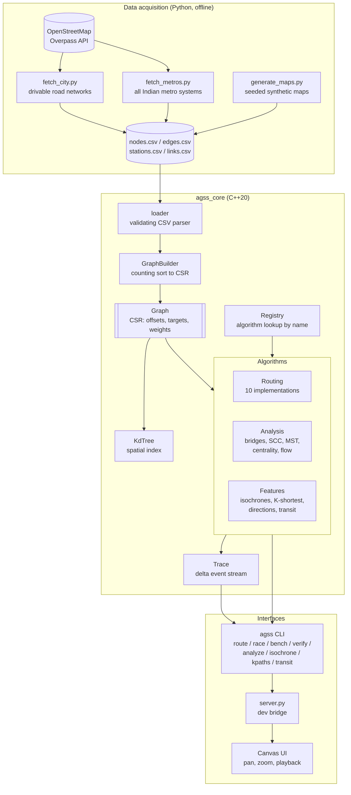
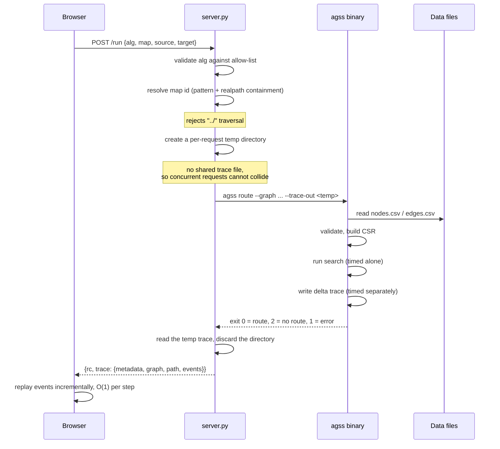
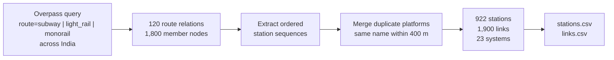

# Adaptive Graph Search Suite

**A C++20 pathfinding and network-analysis engine for real Indian road and metro networks.**

Ten routing algorithms, six network-analysis algorithms, multi-modal road + metro
routing across every operational metro system in India, and a browser visualiser —
all built on a cache-friendly CSR graph that handles real city-scale data.

**[Try it in your browser →](https://adarshcod30.github.io/Adaptive-Graph-Search-Suite/)**
The C++ engine is compiled to WebAssembly and runs entirely in the page: no
server, no install, nothing uploaded.

`graph-algorithms` · `pathfinding` · `cpp20` · `dijkstra` · `astar` · `openstreetmap`
· `route-planning` · `transit` · `india` · `betweenness-centrality` · `visualization`

---

## Table of contents

- [Why this exists](#why-this-exists)
- [Key features](#key-features)
- [Tech stack](#tech-stack)
- [System architecture](#system-architecture)
- [Request flow](#request-flow)
- [Data pipeline](#data-pipeline)
- [Getting started](#getting-started)
- [Usage](#usage)
- [Benchmarks](#benchmarks)
- [Correctness](#correctness)
- [Project structure](#project-structure)
- [Testing](#testing)
- [Running it in the browser](#running-it-in-the-browser)
- [Deployment](#deployment)
- [Roadmap](#roadmap)
- [Contributing](#contributing)
- [Licence and data attribution](#licence-and-data-attribution)

---

## Why this exists

Most pathfinding visualisers animate a textbook algorithm on a toy grid. This one
runs production-shaped algorithms on **real OpenStreetMap road networks** — 47,828
junctions for central Delhi alone — and answers questions about them that a
shortest-path query cannot:

| Question | Answered by |
|---|---|
| What is the fastest route from A to B? | Dijkstra / A\* / bidirectional search |
| Give me three alternatives. | Yen's K-shortest paths |
| Which single road closure severs a neighbourhood? | Tarjan bridges + articulation points |
| Which intersections carry the most through-traffic? | Brandes betweenness centrality |
| Where can I get to in 20 minutes? | Isochrone bands + convex hull |
| How much traffic can move from A to B per hour? | Dinic max-flow / min-cut |
| What if this bridge shuts today? | Edge-closure masks, re-run any algorithm |
| Should I drive or take the metro? | Multi-modal road + rail routing |

## Key features

| Feature | Detail |
|---|---|
| **10 routing algorithms** | BFS, DFS, Dijkstra, A\*, Greedy best-first, Bellman-Ford, Floyd-Warshall, Johnson, Bidirectional Dijkstra, Dial's bucket queue |
| **6 analysis algorithms** | Bridges & articulation points, strongly connected components, minimum spanning tree, betweenness centrality, max-flow/min-cut, K-shortest paths |
| **Real road data** | OpenStreetMap importer for 10 preset Indian cities, or any bounding box |
| **All Indian metros** | 922 stations, 23 systems, 22 cities — Delhi, Mumbai, Namma, Chennai, Kolkata, Hyderabad and more, imported live from OSM |
| **Multi-modal routing** | Road and rail combined into one time-weighted graph; plain Dijkstra then solves it |
| **Isochrones** | Reachability bands with convex-hull service areas |
| **What-if closures** | Shut any road, re-run any algorithm, see the detour |
| **Turn-by-turn directions** | True bearings, merged straight runs, human-readable steps |
| **Algorithm race mode** | Every algorithm on the same query, side by side, with optimality verdicts |
| **Benchmark harness** | Median-of-N timing with tracing disabled; emits a Markdown table for CI |
| **Differential verification** | Optimal algorithms cross-check each other on random queries |
| **CSR graph core** | Flat-array adjacency with contiguous neighbour scans |
| **Delta traces** | Θ(V + E) event stream instead of Θ(V²) frame snapshots |
| **Geodesy done right** | Haversine and equirectangular metrics; admissible A\* on lat/lon |
| **k-d tree** | O(log V) nearest-node snapping for coordinate queries |
| **Runs in the browser** | The whole engine compiled to WebAssembly, 350 KB, no backend |
| **Real map basemap** | Web Mercator tiles under the graph — watch a search expand over actual streets |

## Tech stack

| Layer | Technology |
|---|---|
| Engine | C++20 — `std::span`, structured bindings, CTAD; no third-party runtime dependencies |
| Build | CMake 3.16+ (primary), plain Makefile (fallback, no CMake needed) |
| Tests | Custom 120-line header harness; 60 cases, 4,119 assertions |
| CI | GitHub Actions — gcc/clang/MSVC on Linux, macOS, Windows; ASan + UBSan; differential correctness; data reproducibility |
| Data | OpenStreetMap via Overpass API; Python 3.9+ import scripts (stdlib only) |
| Browser | Emscripten → WebAssembly; string-in/string-out JSON boundary |
| Basemap | Custom Web Mercator tile layer on the same canvas; CARTO / OpenStreetMap raster tiles |
| UI | Vanilla JS, HTML5 Canvas, CSS glassmorphism — no framework, no bundler |
| Dev server | Python `http.server`, stdlib only (optional; the WASM build needs none) |

---

## System architecture



**In plain language.** Python scripts pull real data from OpenStreetMap once and
write plain CSV. The C++ core loads that CSV through a validating parser — an edge
pointing at a node that was never declared is rejected here rather than causing
trouble three layers down. The builder sorts edges into Compressed Sparse Row
layout, giving every algorithm a contiguous array to scan instead of a hash map to
chase pointers through. Algorithms register themselves by name at start-up, so the
CLI, the race mode and the benchmark harness all share one lookup table instead of
each keeping its own `if`/`else` chain. As a search runs it optionally appends
small events to a trace; the browser replays those events to animate the search.

## Request flow



## Data pipeline



**Why the merge step matters.** OpenStreetMap models each platform and each
direction of travel as a separate node, so a major interchange such as Rajiv Chowk
arrives as four or more disconnected stations. Left alone the network fragments and
line changes become impossible. Folding same-named nodes within 400 m into one
canonical station collapsed **873 duplicates** and is what makes interchange
routing work.

Travel times are estimated from great-circle distance and a per-mode average speed,
because OSM carries no timetables. They are indicative, not schedule-accurate.

---

## Getting started

### Requirements

- A C++20 compiler (GCC 10+, Clang 12+, MSVC 19.29+)
- CMake 3.16+ *or* GNU Make
- Python 3.9+ (only for refreshing data)

### Build and run

```bash
git clone https://github.com/adarshcod30/Adaptive-Graph-Search-Suite.git
cd Adaptive-Graph-Search-Suite
make -j
./bin/agss race --graph data/maps/Delhi_NCR --source 0 --target 150
```

With CMake instead:

```bash
cmake -S . -B build -DCMAKE_BUILD_TYPE=Release && cmake --build build -j
```

### Launch the visualiser

```bash
make -j && python3 server.py
```

Then open <http://127.0.0.1:9000/>.

### Fetch real city data

```bash
python3 scripts/fetch_city.py --city bengaluru
```

```bash
python3 scripts/fetch_metros.py
```

---

## Usage

Every command takes `--graph <dir>`, and `--geo` when the coordinates are lat/lon
(all OSM imports are).

### Route

```bash
./bin/agss route --graph data/cities/Delhi_Central --geo --alg astar --source 0 --target 40000 --directions
```

### Race every algorithm on one query

```bash
./bin/agss race --graph data/cities/Delhi_Central --geo --source 0 --target 40000
```

```
ALG                   MS   EXPANDED    RELAXED   HOPS          COST  OPTIMAL
----------------------------------------------------------------------------
astar             1.9846      18999      47854    287     22017.900  optimal
bellmanford      36.1405        160   13986758    287     22017.900  optimal
bfs               0.6792      40992     105068    149     26252.030  suboptimal
bidijkstra        2.6908      36099      93749    287     22017.900  optimal
dfs               0.3595      26070      69939   9217    599711.880  suboptimal
dial              0.0000          0          0      -             -  declined
dijkstra          2.4639      43818     113050    287     22017.900  optimal
floydwarshall     0.0000          0          0      -             -  declined
greedy            0.0273        250        537    239     24556.200  suboptimal
johnson           2.9055      43818     113050    287     22017.900  optimal

reference optimal cost: 22017.900
  dial (skipped: needs integer edge weights)
  floydwarshall (skipped: graph exceeds 5000 nodes)
```

An algorithm that **declines** is reported separately from one that searched and
found nothing. Dial's bucket queue is only defined for integer weights, and
Floyd-Warshall's V² matrices do not fit at this scale — both say so rather than
returning a rounded or truncated answer.

### Analyse the network

```bash
./bin/agss analyze --graph data/cities/Delhi_Central --geo --what bridges
```

`--what` accepts `bridges`, `scc`, `mst`, `centrality`, `flow`, or `all`.

### Isochrones

```bash
./bin/agss isochrone --graph data/cities/Delhi_Central --geo --source 0 --cutoffs 1000,3000,5000 --out bands.json
```

### Alternative routes

```bash
./bin/agss kpaths --graph data/maps/Delhi_NCR --source 0 --target 150 --k 3
```

### Close a road and re-route

```bash
./bin/agss route --graph data/maps/Delhi_NCR --alg dijkstra --source 0 --target 150 --close 12:47
```

### Metro and multi-modal

```bash
./bin/agss transit --transit data/transit --list
```

```bash
./bin/agss transit --transit data/transit --city Delhi --source "Rajiv Chowk" --target "Akshardham"
```

```bash
./bin/agss transit --transit data/transit --city Delhi --graph data/cities/Delhi_Central --source "Rajiv Chowk" --target "Akshardham"
```

### Benchmark and verify

```bash
./bin/agss bench --markdown --reps 7
```

```bash
./bin/agss verify --graph data/maps/Delhi_NCR --samples 200
```

---

## Benchmarks

Central Delhi, imported from OpenStreetMap: **47,828 junction nodes, 123,288
directed edges**. Median of 5 runs, Apple M-series, `-O2`, tracing disabled.

| Algorithm | Median ms | Nodes expanded | Cost (m) | Optimal |
|---|---|---|---|---|
| Greedy best-first | 0.006 | 161 | 15,746 | no |
| DFS | 0.223 | 17,774 | 659,160 | no |
| BFS | 0.289 | 22,225 | 15,232 | no |
| **A\*** | **0.295** | **3,547** | **13,820** | **yes** |
| Dijkstra | 1.108 | 20,312 | 13,820 | yes |
| Johnson | 1.330 | 20,312 | 13,820 | yes |
| Bidirectional Dijkstra | 1.744 | 23,243 | 13,820 | yes |
| Bellman-Ford | 34.558 | 160 | 13,820 | yes |

A\* expands **5.7× fewer nodes than Dijkstra** and runs **3.8× faster** while
returning the identical optimal cost — the payoff from a correct geographic
heuristic. Dial and Floyd-Warshall decline on this graph (non-integer weights,
and V² memory respectively) rather than answering approximately.

Analysis on the same graph: bridges and articulation points in **9.6 ms**
(6,753 bridges found), strongly connected components in **1.1 ms**.

### Trace size

The trace format stores deltas rather than per-frame snapshots, which is what
allows city-scale graphs:

| Nodes | Previous format | Delta format | Reduction |
|---|---|---|---|
| 3,600 | 30 MB | 0.8 MB | 37× |
| 10,000 | 239 MB | 2.3 MB | 103× |
| 19,600 | 980 MB | 4.7 MB | 209× |

The reduction grows with graph size because the old format was Θ(V²) and the new
one is Θ(V + E).

---

## Correctness

Four algorithms guarantee optimality by construction, so **they are each other's
oracle** — no golden files, no hand-computed expected answers:

```bash
./bin/agss verify --graph data/maps/Delhi_NCR --samples 200
```

The test suite asserts, over randomly generated graphs, that:

- every algorithm claiming optimality returns the identical cost;
- every returned path is a real sequence of edges starting at the source and
  ending at the target;
- BFS is hop-minimal on unit-weight graphs;
- suboptimal algorithms are never *cheaper* than the optimum;
- A\* matches Dijkstra on geographic graphs (pinning heuristic admissibility);
- bidirectional search matches Dijkstra while expanding fewer nodes;
- Yen's routes are loopless, distinct and cost-ordered;
- a delta trace replays into exactly the path the search returned;
- every generated graph keeps the straight-line heuristic admissible.

### The admissibility invariant

A\* and Greedy estimate remaining cost with straight-line distance. That is only
a *lower* bound — and therefore only safe — when no edge weighs less than the
straight-line distance between its endpoints. Real roads always satisfy this
(a road cannot be shorter than the crow flies), but a generator can easily
violate it, and this one did: it applied a noise factor from 0.9 to 1.2, so
around 40% of edges came out shorter than the straight line. A\* then disagreed
with Dijkstra on roughly 2% of queries while looking like an algorithm bug.

The generator now uses a detour factor of 1.05-1.35, and `Graph` exposes the
invariant directly:

```cpp
if (!g.heuristic_is_admissible()) { /* A* is not optimal on this graph */ }
```

`agss verify` prints a warning when a graph violates it, so a data problem never
again reads as an algorithm problem.

---

## Project structure

```
.
├── CMakeLists.txt              Primary build
├── Makefile                    Fallback build; make test / sanitize / bench / verify
├── include/agss/               Public headers
│   ├── graph.hpp               CSR graph
│   ├── graph_builder.hpp       Validating builder
│   ├── loader.hpp              CSV parsing
│   ├── error.hpp               Result<T> / Error
│   ├── geo.hpp                 Haversine, bearings, turn angles
│   ├── algorithm.hpp           Interface, registry, closure masks
│   ├── trace.hpp               Delta event stream
│   ├── analysis.hpp            Bridges, SCC, MST, centrality, flow
│   ├── isochrone.hpp           Reachability bands, convex hull
│   ├── kshortest.hpp           Yen's algorithm
│   ├── directions.hpp          Turn-by-turn
│   ├── transit.hpp             Metro networks, multi-modal
│   └── kdtree.hpp              Spatial index
├── src/
│   ├── algorithms/             uninformed, weighted, global, kshortest
│   ├── analysis/               connectivity, centrality, spanning, flow
│   ├── transit/                multimodal
│   └── cli/main.cpp            Subcommand CLI
├── tests/                      60 cases across 6 files
├── scripts/
│   ├── fetch_city.py           OSM road networks
│   ├── fetch_metros.py         All Indian metro systems
│   └── generate_maps.py        Seeded synthetic maps
├── data/
│   ├── maps/                   5 synthetic maps (committed, reproducible)
│   ├── transit/                922 stations, 1,900 links (committed)
│   └── cities/                 OSM imports (gitignored, fetched on demand)
├── web/                        Browser app (WebAssembly)
│   ├── index.html              Shell
│   ├── app.js                  Mercator projection, tile layer, trace replay, rendering
│   └── engine/                 Generated .wasm + glue (gitignored)
├── ui/                         Legacy server-backed visualiser
└── server.py                   Development bridge (optional)
```

## Testing

```bash
make test
```

```bash
make sanitize
```

```bash
make verify
```

```bash
node tests/wasm_smoke.mjs
```

`make sanitize` rebuilds under AddressSanitizer and UndefinedBehaviorSanitizer and
runs the whole suite; the same job runs in CI on every push. The WASM smoke test
exercises every exported entry point and asserts the browser engine agrees with
the native one, so a broken WebAssembly build cannot reach the published demo.

## Running it in the browser

```bash
emcmake cmake -S . -B build/wasm -DCMAKE_BUILD_TYPE=Release -DAGSS_BUILD_TESTS=OFF -DAGSS_BUILD_CLI=OFF
```

```bash
cmake --build build/wasm --parallel && python3 -m http.server 8080
```

Then open <http://127.0.0.1:8080/web/>.

### The basemap

Geographic networks render over real map tiles, so the search is visibly
crawling actual streets rather than an abstract diagram. Four options in the
**Basemap** selector: dark, light, standard OpenStreetMap, or none.

It is a small slippy-map layer drawn straight onto the same canvas — no
mapping library. That is possible because the camera already works in **Web
Mercator**, the projection every raster tile server publishes in, so a tile is
just an image placed at a known world rectangle. Sharing one projection keeps
the map and the graph aligned *by construction* rather than by two libraries
agreeing, and it keeps the page dependency-free, which is the reason it can
ship as a single static file.

Some details that matter in practice:

- **Node coordinates are projected once at load** into parallel `Float64Array`s.
  Drawing 47,828 nodes then costs two array reads each, instead of a `log`/`tan`
  per node per frame.
- **Sizes derive from the slippy zoom level**, not from `camera.zoom`. Moving to
  Mercator changed that number from tens to millions, and the old factor drew
  every node at its clamp — 47k dots burying the map they were meant to sit on.
- **Node dots appear only from zoom 15**, below which the edges carry the
  network and the basemap carries the context.
- **A coarser cached tile is stretched in** while a sharp one loads, so panning
  never flashes empty background.
- **The camera is clamped to the tile pyramid**, so scrolling cannot leave the
  available zoom range.

Planar synthetic graphs have no real-world coordinates, so no basemap applies
and the selector says so.

Tiles come from CARTO and OpenStreetMap; attribution is displayed on the map,
as both providers require. The demo is deliberately light on tile traffic — at
most 8 requests in flight and a bounded cache.

### Why WebAssembly replaced the Python bridge rather than fixing it

The old flow was browser → Python server → `subprocess` → binary → shared file
on disk → back. Two of its defects were only visible with more than one user:

- the `map` parameter was joined onto the maps directory unnormalised, so `../`
  read graphs from anywhere on disk;
- every request wrote to one fixed `ui/trace.json` under a threading server.
  Measured under ten concurrent requests, **five returned no trace at all and
  three returned another client's algorithm** — zero correct.

Both are now *unrepresentable* rather than patched: with the engine inside the
page there is no subprocess, no filesystem path from user input, and no shared
file, because each tab owns its own engine instance and its own memory. The
`server.py` bridge is still there for local development and both defects are
fixed in it too, but nothing in the published demo depends on it.

### What the browser build costs

| | Native | WebAssembly |
|---|---|---|
| A\* on 47,828-node Delhi | 0.29 ms | ~2 ms |
| Engine size | 326 KB binary | 350 KB `.wasm` + 63 KB glue |
| Install steps | clone, toolchain, build | open a link |

One caveat the UI states honestly: browsers clamp `performance.now()` to about
0.1 ms as a Spectre mitigation, and the engine's `steady_clock` rides on it. A
single search on a small graph therefore reports either 0.0 or 0.1 ms and
nothing between, so the page shows `< 0.1 ms` rather than a precise-looking
zero, and **Race all** times a batch of runs to amortise the clamp away.

## Deployment

This is a local-first tool: a static binary plus CSV data, with an optional
development server for the browser UI.

| Environment | How |
|---|---|
| Local CLI | `make -j` → `./bin/agss` |
| Local UI | `python3 server.py` → <http://127.0.0.1:9000/> |
| Live demo | GitHub Pages, rebuilt from source on every push to `main` — the WASM smoke test gates publication |
| CI | GitHub Actions on push and PR — build matrix, sanitizers, differential correctness, data-reproducibility check, WASM smoke test, benchmark table published to the job summary |
| Library | `cmake --install` exports `agss_core` plus headers for `find_package`/`FetchContent` |

`server.py` binds to loopback and is a development tool, not a hardened public
service.

## Roadmap

- [x] WebAssembly build so the visualiser is a link, not a clone
- [ ] Contraction Hierarchies and ALT landmark preprocessing
- [ ] Time-dependent edge weights (rush-hour routing)
- [ ] 50-city demo tier, with benchmark-tier extracts as release assets
- [ ] Python bindings via pybind11
- [ ] Jump Point Search for grid maps
- [ ] Louvain community detection for neighbourhood boundaries

## Contributing

Issues and pull requests are welcome. Please make sure `make test` and
`make sanitize` both pass, and run `make format` before submitting.

Good first issues: implement Jump Point Search, add a city preset to
`scripts/fetch_city.py`, or extend the UI to render isochrone bands.

## Licence and data attribution

Source code is released under the [MIT Licence](LICENSE).

Road and transit data is derived from **OpenStreetMap**, © OpenStreetMap
contributors, available under the [Open Database Licence
(ODbL) 1.0](https://opendatacommons.org/licenses/odbl/). Any redistribution of the
data or of works derived from it must preserve that attribution and licence.

Basemap tiles are served by [CARTO](https://carto.com/basemaps/) and the
[OpenStreetMap tile servers](https://operations.osmfoundation.org/policies/tiles/),
© OpenStreetMap contributors © CARTO. Attribution is shown in the map view. If
you fork this and expect real traffic, point the tile URLs at your own provider
rather than leaning on theirs.

## Contact

Adarsh Dwivedi — [github.com/adarshcod30](https://github.com/adarshcod30)
